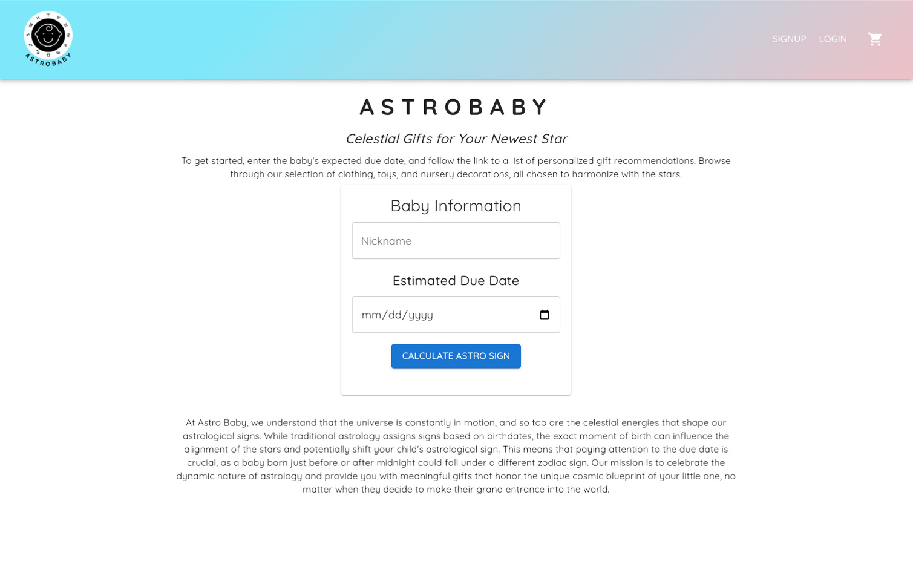
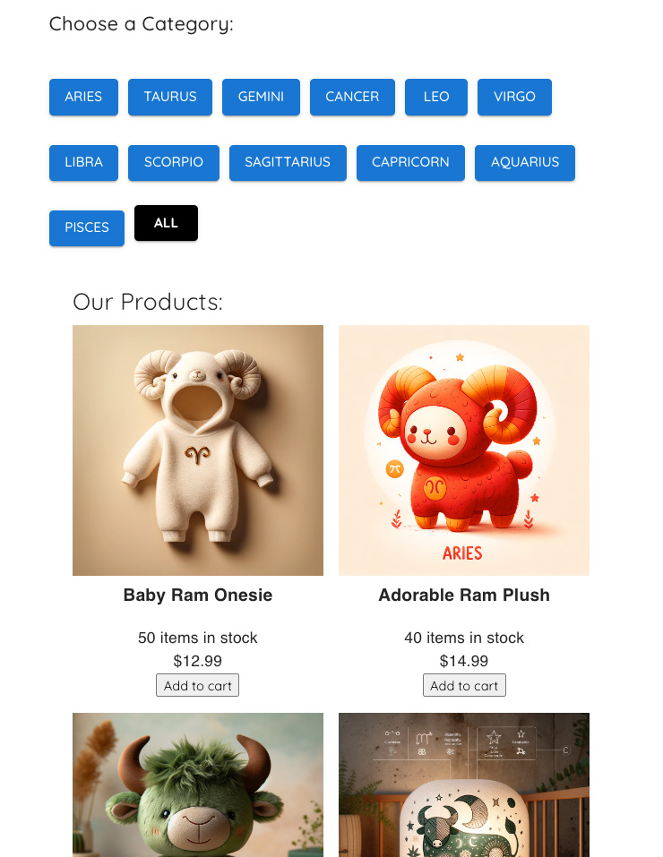
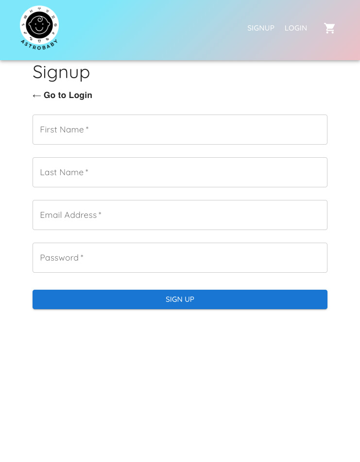
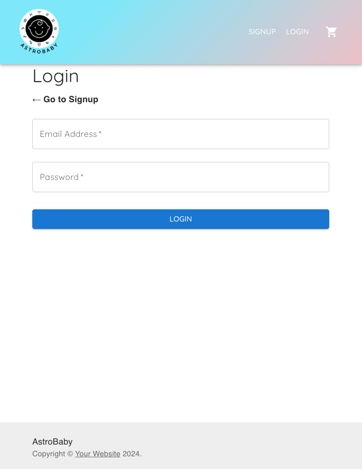

# ASTROBABY: A MERN Stack Single-Page Application

Welcome to ASTROBABY, an innovative e-commerce platform designed specifically for expecting parents, family, and friends. Our unique approach integrates astrology into the shopping experience, offering personalized product recommendations based on the astrological signs of upcoming newborns. From clothing and toys to nursery decorations, ASTROBABY ensures that every gift you choose aligns with the stars.




## Project Overview

ASTROBABY is built with the modern MERN stack - MongoDB, Express.js, React, and Node.js, featuring a GraphQL API for efficient data handling. This single-page application (SPA) is designed to be intuitive, responsive, and user-centric, ensuring a seamless shopping experience from browsing to checkout.

## Key Features

-   **Astrology-Based Product Recommendations**: Curate products based on astrological signs for a personalized touch.
-   **User Authentication**: Secure login and user account management with JWT.
-   **Dynamic Shopping Cart**: Users can add, update, and remove products from their cart.
-   **Stripe Integration**: A secure and straightforward checkout process powered by Stripe. 
-   **Responsive Design**: A polished UI that's responsive across all devices.

## Technologies Used

-   Frontend: React + Material UI
-   Backend: Node.js, Express.js
-   Database: MongoDB with Mongoose ODM
-   API: GraphQL for queries and mutations
-   Authentication: JWT
-   Payment Processing: Stripe
-   Deployment: Render

## Links

-   [GitHub Repository](https://github.com/codingxcat/ASTROBABY)
-   [Deployed Application on Render](https://astrobaby.onrender.com/)

## Collaborators

-   [Cat](https://github.com/catxcoding)
-   [Jackie](https://github.com/jaclynnburch)
-   [Alan](https://github.com/Aslan-The-Lion)
-   [Andres](https://github.com/Aserrano7)

## Getting Started


### Installation

1. **Clone the repository**

```bash
   git clone https://github.com/catxcoding/ASTROBABY.git
   cd ASTROBABY
   npm install
```

2. **Install Server Dependencies**

```bash
    cd server
    npm install
```

3. **Install Frontend Dependencies**

```bash
    cd client
    npm install
```

4. **Configure environment variables**
    - In the server directory, create a .env file with the following contents:

```bash
    MONGO_URI=<Your_MongoDB_URI>
    JWT_SECRET=<Your_JWT_Secret>
    STRIPE_SECRET_KEY=<Your_Stripe_Secret_Key>
```

### Running the Application

1. **Start from ROOT Directory**

```bash
   npm run start-all
```

## Deployment

ASTROBABY is deployed on [Render](https://astrobaby.onrender.com/)

### Products


### Sign Up Page


### Log In Page


## Future Developments

ASTROBABY is committed to enhancing your shopping and astrological experience with continuous improvements and new features. Here are some of the exciting developments we're planning for the future:

- **Loading Page**: Implement a stylish loading page featuring our logo for a smoother user experience.
- **Registry or Favorites**: Allow users to create a registry or list of favorite products for easy sharing with friends and family.
- **Send Registry Link**: Enable users to send their registry link to friends and family, making gift-giving simple and personal.
- **More Products**: Expand our product range to include a wider variety of astrology-themed items for babies and parents.
- **Marketplace for Artists**: Create a marketplace for artists to sell their astrology-themed artwork, providing a platform for creative expression and unique finds.
- **Birth Chart Integration**: Offer birth chart integration to provide personalized product recommendations based on the baby's birth chart.
- **Birth Chart Readings for Your Baby**: Provide professional birth chart readings for your baby, offering insights into their personality and potential.
- **Astrology Parenting Tips**: Share astrology-based parenting tips to help parents connect with their child on a cosmic level.

Stay tuned as we bring these features to life and continue to make ASTROBABY the go-to destination for astrology-loving families!


## Resources

-   Tutoring via Preply
-   MUI https://mui.com/material-ui/
-   MongoDB
-   Eslint
-   DALLE Open AI for Product Images

## Dependencies

1. ROOT
`npm install @apollo/server@^4.10.1 @mui/lab@^5.0.0-alpha.169 bcrypt@^5.1.1 express@^4.18.3 graphql@^16.8.1 jsonwebtoken@^8.5.1 mongodb@^6.5.0`
2. SERVER
`npm install @apollo/server@^4.10.1 apollo-server-express@^3.13.0 dotenv@^16.4.5 express@^4.18.3 graphql@^16.8.1 jsonwebtoken@^9.0.2 mongodb@^6.5.0 mongoose@^7.0.2 stripe@^14.22.0 bcrypt@^5.1.1`
3. CLIENT
`npm install @apollo/client@^3.9.7 @emotion/react@^11.11.4 @emotion/styled@^11.11.0 @mui/icons-material@^5.15.14 @mui/lab@^5.0.0-alpha.169 @mui/material@^5.15.14 @stripe/react-stripe-js@^2.6.2 @stripe/stripe-js@^3.0.10 @testing-library/react@^14.2.1 graphql@^16.8.1 happy-dom@^13.9.0 jsonwebtoken@^9.0.2 jwt-decode@^4.0.0 react@^18.2.0 react-dom@^18.2.0 react-router-dom@^6.22.3`
4. CLIENT DEV
`npm install --save-dev @types/react@^18.2.0 @types/react-dom@^18.2.0 @vitejs/plugin-react@^4.2.1 eslint@^8.57.0 eslint-plugin-react@^7.34.0 eslint-plugin-react-hooks@^4.6.0 eslint-plugin-react-refresh@^0.4.5 vite@^5.1.6`

## License

ASTROBABY is licensed under the MIT License. See the [LICENSE](LICENSE.md) file for details.